# AI-Enabled Healthcare Management System

[](https://opensource.org/licenses/MIT) 
[](https://www.python.org/downloads/) 
[](https://flask.palletsprojects.com/) 
[-purple)](https://ollama.com) 
[](https://mabdulre9.github.io/healthcare-system/)

> **100% Private Electronic Medical Records (EMR) with Offline AI Assistant**  
> 📖 **Documentation:** https://mabdulre9.github.io/ai-enabled-healthcare-system/

A comprehensive, privacy-first healthcare management system featuring completely offline AI powered by Ollama. No cloud APIs, no data sharing, 100% local and private.

 

---
## Key Features

### Complete EMR System

- **Patient Management**
  - Registration, demographics, contact information
- **Visit Tracking**
  - Consultations, diagnoses, treatment plans
- **Medical History**
  - Active conditions, medications, allergies, family history
- **Vital Signs**
  - Blood pressure, heart rate, temperature, BMI tracking
- **Lab Results**
  - Laboratory test results and trending
- **Immunizations**
  - Vaccination records management

### Offline AI Clinical Assistant

- **100% Private** - All data stays on your computer
- **Completely Offline** - No internet required for AI
- **Real-time Streaming** - Word-by-word response generation
- **Context-Aware** - Uses complete patient data for insights
- **Memory Management** - Unload models to free RAM
- **Clinical Decision Support** - Differential diagnosis, drug interactions, treatment recommendations
- **Zero Cost** - No API fees, no subscriptions

### Report Generator

- **Word Reports** - Medical reports with clinic letterhead
- **Complete Records** - Full patient history export
- **On Visit** - Single visit history export
- **One-Click Generation** - Instant .docx documents

### FHIR Integration

- **Import FHIR R4** - Standard-compliant patient data
- **Batch Processing** - Import multiple patients
- **Data Validation** - Automatic format checking

---

## System Architecture

The system follows a modern layered architecture for scalability, maintainability, and complete offline operation:



### Architecture Overview

- **Presentation Layer**: HTML5, CSS3, and vanilla JavaScript for responsive UI
- **Application Layer**: Flask 3.0.0 backend handling business logic and routing
- **AI Layer**: Ollama integration for completely offline AI assistance
- **Data Layer**: Secure local data persistence with privacy-first design
- **Integration Layer**: FHIR R4 compliant import/export capabilities

---

## Quick Start

### Prerequisites

- Python 3.12 or higher
- Ollama (for AI features)

### Installation

```bash
# 1. Clone or download this repository
cd healthcare-management-system

# 2. Create virtual environment
python -m venv venv

# 3. Activate virtual environment
# Windows:
venv\Scripts\activate
# Linux/Mac:
source venv/bin/activate

# 4. Install dependencies
pip install -r requirements.txt

# 5. Run the application
python app.py
```

Open browser: **http://localhost:5000**

---

## Ollama AI Setup

### Step 1: Install Ollama

**Download from:** https://ollama.com/download

- **Windows:** Download installer, run, done
- **macOS:** Download .dmg, install
- **Linux:** `curl -fsSL https://ollama.com/install.sh | sh`

### Step 2: Download a Model

```bash
# Choose any model for example:

# Small & Fast (523MB) - Good for testing
ollama pull qwen3:0.6b

# Balanced (2.5GB) - Best overall
ollama pull qwen2.5:4b

# High Quality (2GB) - More accurate
ollama pull llama3.2:3b

# Check downloaded models
ollama list
```

### Step 3: Configure in System

1. Go to **Settings**
2. Enter model name (e.g., `qwen2.5:4b`)
3. Click **TEST MODEL** to verify
4. Click **SAVE SETTINGS**
5. Use AI Assistant - completely private

---

## Why This System?

### Complete Privacy

- **No Cloud APIs** - AI runs locally on your computer
- **No Data Sharing** - Patient data never leaves your system
- **HIPAA-Ready** - Deploy on compliant infrastructure
- **Offline Capable** - Works without internet

### Zero Cost

- **Free Software** - Open source, no licenses
- **Free AI** - Ollama is completely free
- **No Subscriptions** - No monthly fees ever
- **No Hidden Costs** - Everything is free

### Full Control

- **Self-Hosted** - Run on your own hardware
- **Customizable** - Modify to your needs
- **No Vendor Lock-in** - Your data, your control
- **Open Standards** - FHIR R4 compliant

---

## Use Cases

- **Small Clinics** - Affordable EMR without subscriptions
- **Solo Practitioners** - Complete patient management
- **Medical Education** - Safe learning environment
- **Clinical Research** - Structured data collection
- **Remote Healthcare** - Works completely offline
- **Home Health** - Portable, no connectivity needed

---

## Tech Stack

- **Backend:** Python Flask 3.0.0
- **Frontend:** HTML5, CSS3, Vanilla JavaScript
- **AI:** Ollama (100% offline)
- **Documents:** python-docx
- **Standards:** FHIR R4, WCAG AAA

---

## System Requirements

- **OS:** Windows 10+, macOS, or Linux
- **Python:** 3.12 or higher
- **RAM:** 8GB minimum (16GB+ recommended for AI)
- **Storage:** Depends on LLM
- **Internet:** Only for initial download

---

## Configuration

Edit clinic information in `app.py` (lines 18-22):

```python
CLINIC_NAME = 'Your Clinic Name'
CLINIC_ADDRESS = '123 Medical Center Dr'
CLINIC_PHONE = '(555) 123-4567'
CLINIC_EMAIL = 'contact@clinic.com'
```

---

## Contributing

Contributions welcome! Please:

1. Fork the repository
2. Create feature branch
3. Make your changes
4. Submit pull request

---

## License

MIT License - see [LICENSE](LICENSE) file

---

## Acknowledgments

- **Ollama** - For making local AI accessible and free
- **FHIR Community** - For healthcare interoperability standards
- **Flask** - For the excellent web framework

---

## Support

For issues or questions:

- **GitHub Issues:** Report bugs or request features
- **Documentation:** Check built-in docs at /docs
- **Troubleshooting:** See TROUBLESHOOTING.md

---

**Built with ❤️ for healthcare professionals**

**100% Private • 100% Free • 100% Offline**

[⭐ Star this repo](https://github.com/mabdulre9/healthcare-system) if you find it useful!

---

## Feedback & Issues

If you encounter any bugs, have suggestions, or ideas for improvement, don’t hesitate to reach out at **mabdulre9@gmail.com** or open an issue on GitHub.

Contributions and feedback are always welcome!
